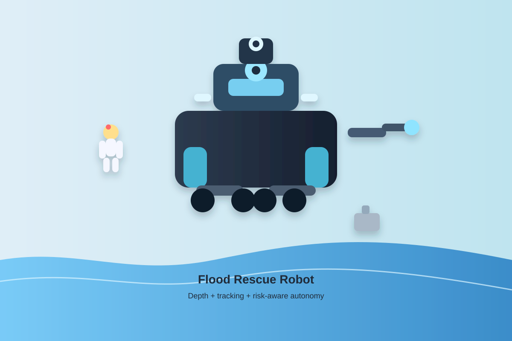
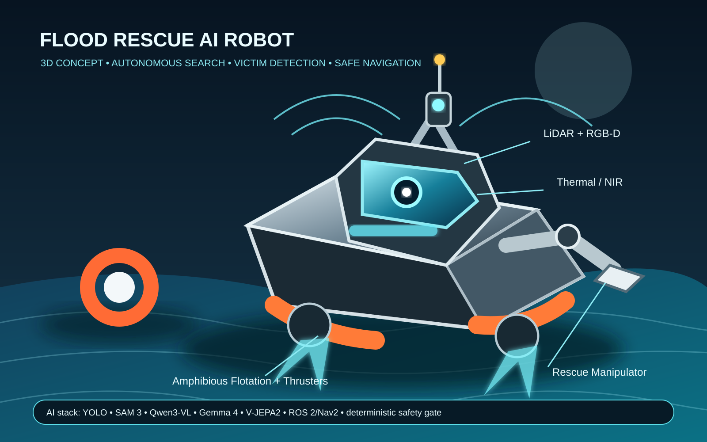

# Flood Rescue AI Robot

A PyTorch-based autonomous perception system for flood rescue operations. The repository combines depth estimation, multi-object tracking, spatial hazard extraction, embodied AI, multimodal reasoning, world modeling and safety-aware robot action planning.

## Overview

Flood rescue requires robots to perceive unstable terrain, detect victims, avoid obstacles, and prioritize safe navigation under poor visual conditions. This project models that pipeline in a modular, deployable way.

## 3D Robot Concept





**Concept features:** amphibious flotation and thrusters, RGB-D/thermal/NIR/LiDAR perception, rescue manipulator, 3D semantic world modeling, multimodal AI reasoning, and a deterministic safety gate.

See [docs/3D_ROBOT_CONCEPT.md](docs/3D_ROBOT_CONCEPT.md) for the design concept.

## Real-time upgrade

The system supports live processing from a webcam or RTSP stream. The pipeline estimates depth per frame, tracks detected objects, builds a hazard map, and overlays the result in a live OpenCV window.

## Embodied AI architecture

RGB / thermal / NIR / depth / LiDAR / IMU -> YOLO + SAM3 + tracking -> 3D semantic world model -> Qwen3-VL + Gemma 4 E4B reasoning -> V-JEPA2 future prediction -> GR00T N1.7 / FLUX 3 Action candidate actions -> deterministic safety gate -> ROS2/Nav2 + MoveIt2/RRT* -> robot -> action verification.

### Models and roles

- YOLO: fast detection and tracking.
- SAM 3: open-vocabulary segmentation, occlusion boundaries and video tracking.
- Qwen3-VL: primary multimodal scene and rescue reasoning.
- Gemma 4 31B IT: high-capacity multimodal flood-scene reasoning, victim verification, occlusion analysis, route/debris reasoning and rescue-plan cross-checking.
- Gemma 4 E4B-it: lightweight fallback multimodal reasoning.
- LeRobot: datasets, teleoperation, training and deployment.
- SmolVLA, pi0/pi0.5, X-VLA, VLA-JEPA: action/VLA candidates.
- NVIDIA GR00T N1.7 3B: embodied action-policy candidate for adaptation to the flood-robot embodiment.
- FLUX 3 Action Base: world-action adaptation base; not a complete robot policy and requires an embodiment-specific action head.
- V-JEPA2/VLA-JEPA: temporal world-model and future-state prediction.
- LTX-2.5-Diffusers: offline synthetic video/audio scenario generation and visual diversity.
- MiniMax H3 Turbo LoRA: offline synthetic audio-visual scenario generation and rare-event prototyping.
- RGB-D + LiDAR + Open3D: 3D semantic mapping.
- Thermal + NIR + depth/LiDAR: darkness and low-visibility perception.
- Isaac Sim + Isaac Lab: realistic 3D robot simulation, synthetic data and sim-to-real testing.

## Gemma 4 31B IT multimodal reasoning

The repository integrates [google/gemma-4-31B-it](https://huggingface.co/google/gemma-4-31B-it) as a multimodal reasoning model for flood-rescue scene interpretation. It accepts image + text inputs through Transformers and can also be served with vLLM. The model weights are downloaded at runtime and are not committed to this repository.

Recommended flow:

RGB / thermal / NIR / depth / LiDAR -> perception + tracking -> 3D semantic scene -> **Gemma 4 31B IT** -> structured rescue decision -> VLA/action candidates -> deterministic safety gate.

Gemma 4 31B IT is advisory only: it cannot directly command motors, navigation actuators, or rescue mechanisms. Unknown or occluded people/objects must be re-observed, and every candidate action remains subject to collision checking, exclusion zones, sensor-health checks and emergency-stop logic.

## Safety

Foundation, generative and action models never bypass deterministic safety. Reasoning models propose priorities; action models propose candidate actions. Collision checking, human-exclusion zones, sensor-health checks, force/torque limits and emergency-stop logic remain authoritative.

See docs/EMBODIED_AI_STACK.md, docs/ADVANCED_MODEL_INTEGRATION.md, config/ai_stack.yaml, config/advanced_models.yaml and config/safety_forecasting.yaml.

## Installation

```bash
git clone https://github.com/Pui89/flood-rescue-ai-robot.git
cd flood-rescue-ai-robot
python -m venv .venv
source .venv/bin/activate
pip install -U pip
pip install -e .
```

## Usage

Run the live real-time demo from a webcam:

```bash
python scripts/run_demo.py --source 0 --display
```

Run from an RTSP stream:

```bash
python scripts/run_demo.py --source "rtsp://username:password@ip:554/stream"
```

Run the smoke test:

```bash
pytest tests/test_tracker.py -q
```

## License

MIT


## 3D / 4D Realistic Flood Rescue Robot Concept


The concept shows the flood-response robot operating in a dynamic disaster scene with RGB-D/LiDAR perception, thermal sensing, victim tracking, an articulated rescue arm, and a time-aware 4D trajectory.

- [3D/4D concept image](docs/flood_rescue_robot_3d_4d_concept.svg)
- [3D/4D video preview](docs/flood_rescue_robot_3d_4d_preview.mp4)

## Pipeline Overview

**Sense → Perceive → Localize → Reason → Plan → Safety Gate → Navigate → Rescue → Verify → Report**


See the full architecture and mission flow in [docs/PIPELINE_OVERVIEW.md](docs/PIPELINE_OVERVIEW.md).
