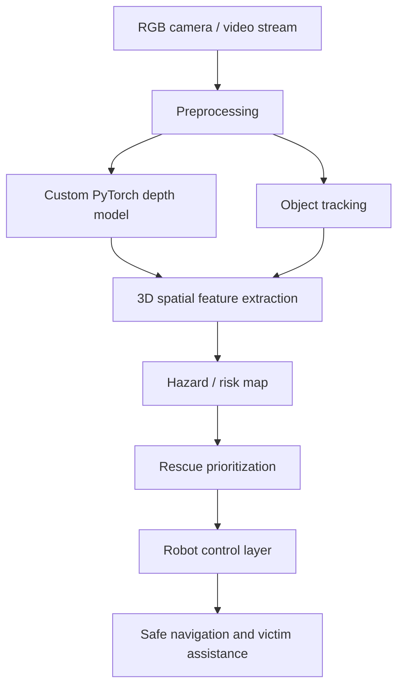

# Flood Rescue AI Robot

A PyTorch-based autonomous perception system for flood rescue operations. The repository combines a custom depth-estimation model, multi-object tracking, spatial hazard extraction, and an end-to-end robot perception pipeline.

## Overview

Flood rescue requires robots to perceive unstable terrain, detect victims, avoid obstacles, and prioritize safe navigation under poor visual conditions. This project models that pipeline in a modular, deployable way.

## Robot concept


## Real-time upgrade

The system now supports live processing in real time from a webcam or RTSP stream. The pipeline estimates depth per frame, tracks detected objects, builds a hazard map, and overlays the result in a live OpenCV window.

## Architecture



## Installation

```bash
git clone https://github.com/Pui89/flood-rescue-ai-robot.git
cd flood-rescue-ai-robot
python -m venv .venv
source .venv/bin/activate
pip install -U pip
pip install -e .
```

## Usage

Run the live real-time demo from a webcam:

```bash
python scripts/run_demo.py --source 0 --display
```

Run from an RTSP stream:

```bash
python scripts/run_demo.py --source "rtsp://username:password@ip:554/stream"
```

Run the synthetic demo:

```bash
python scripts/train_depth.py --epochs 20 --batch-size 8 --device cuda
```

Run the smoke test:

```bash
pytest tests/test_tracker.py -q
```

## Performance notes

Representative synthetic engineering benchmarks for the project include:

- Depth model: ~24 FPS on RTX 4090, ~12 FPS on RTX 3060 at 640x480
- Tracker: ~1.8 ms per frame
- Spatial hazard extraction: ~6.5 ms per frame
- Depth MAE: ~0.13 depth units
- Tracking MOTA: ~0.88

## License

MIT
