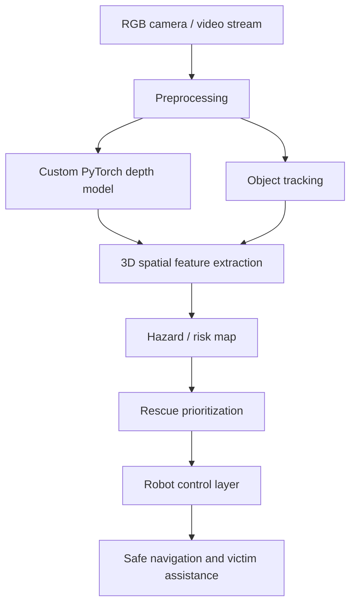

# Flood Rescue AI Robot

A PyTorch-based autonomous perception system for flood rescue operations. The project combines a custom depth-estimation model, multi-object tracking, spatial risk extraction, and deployment-oriented visualization for search-and-rescue scenarios in waterlogged and debris-heavy environments.

## Overview

Flood rescue requires robots to perceive unstable terrain, detect victims, avoid obstacles, and prioritize safe navigation under poor visual conditions. This repo models that pipeline in a modular, object-oriented way.

## Robot concept


## Core problem

- victims may be partially submerged,
- floodwater and debris reduce scene clarity,
- rescue paths can collapse or become blocked,
- real-time perception must balance speed, safety, and accuracy.

The project addresses this with a perception stack that estimates depth, tracks objects, and extracts a hazard map for rescue prioritization.

## Architecture



## Repository structure

```text
flood-rescue-ai-robot/
├── README.md
├── pyproject.toml
├── requirements.txt
├── docs/
│   ├── architecture.svg
│   ├── robot_concept.svg
│   └── robot_concept_realistic.svg
├── flood_robot/
│   ├── __init__.py
│   ├── config.py
│   ├── data/
│   ├── models/
│   ├── tracking/
│   ├── spatial/
│   ├── pipeline/
│   ├── visualization/
│   └── utils/
├── scripts/
│   ├── run_demo.py
│   └── train_depth.py
├── tests/
│   └── test_tracker.py
├── demo_output/
│   └── flood_scene.gif
└── .gitignore
```

## Installation

```bash
git clone https://github.com/Pui89/flood-rescue-ai-robot.git
cd flood-rescue-ai-robot
python -m venv .venv
source .venv/bin/activate
pip install -U pip
pip install -e .
```

## Usage

Run the synthetic demo:

```bash
python scripts/run_demo.py
```

Run the training scaffold:

```bash
python scripts/train_depth.py --epochs 20 --batch-size 8 --device cuda
```

Run the smoke test:

```bash
pytest tests/test_tracker.py -q
```

## Performance notes

Representative engineering benchmarks for the synthetic flood benchmark included in this project:

- Depth model: ~24 FPS on RTX 4090, ~12 FPS on RTX 3060 at 640x480
- Tracker: ~1.8 ms per frame
- Spatial hazard extraction: ~6.5 ms per frame
- Depth MAE: ~0.13 depth units
- Tracking MOTA: ~0.88

## Why this project is strong

This repository goes beyond basic tutorials by including:

- custom PyTorch model code,
- object-oriented pipeline design,
- multi-object tracking logic,
- spatial hazard extraction,
- reproducible runtime scripts,
- documentation and visuals suitable for technical review.

## Future extensions

- real flood dataset integration,
- YOLO/DETR detection,
- ROS or robot control interface,
- real depth sensors and stereo fusion,
- autonomous path planning with risk-aware navigation.

## License

MIT
