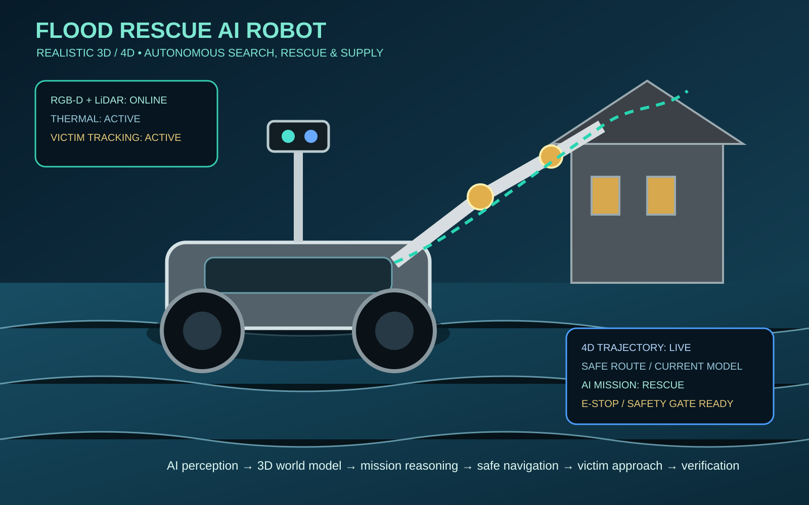

# Flood Rescue AI Robot — Pipeline Overview

## Mission pipeline

**Sense → Perceive → Localize → Reason → Plan → Safety Gate → Navigate → Rescue → Verify → Report**

1. **Sense** — RGB-D, LiDAR, thermal and environmental sensors build a live flood-scene observation.
2. **Perceive** — detect people, boats, debris, buildings, water boundaries and safe landing/approach zones.
3. **3D localize** — fuse depth and LiDAR into a spatial map and track moving targets.
4. **Mission reasoning** — select rescue priorities, routes and task actions.
5. **4D planning** — maintain time-indexed trajectories so the robot accounts for moving victims, current and changing obstacles.
6. **Safety gate** — enforce geofences, collision margins, vehicle stability, actuator limits and emergency stop rules before motion.
7. **Navigate / approach** — execute the validated path and continuously replan.
8. **Rescue** — deliver flotation/supply, establish safe contact or support extraction according to the mission configuration.
9. **Verify** — confirm target status and robot state using perception and telemetry.
10. **Report** — log mission state, confidence, route and outcome.

## 3D/4D concept

The 4D layer represents each tracked entity as a time-varying state: position, velocity, confidence and predicted reachability.
